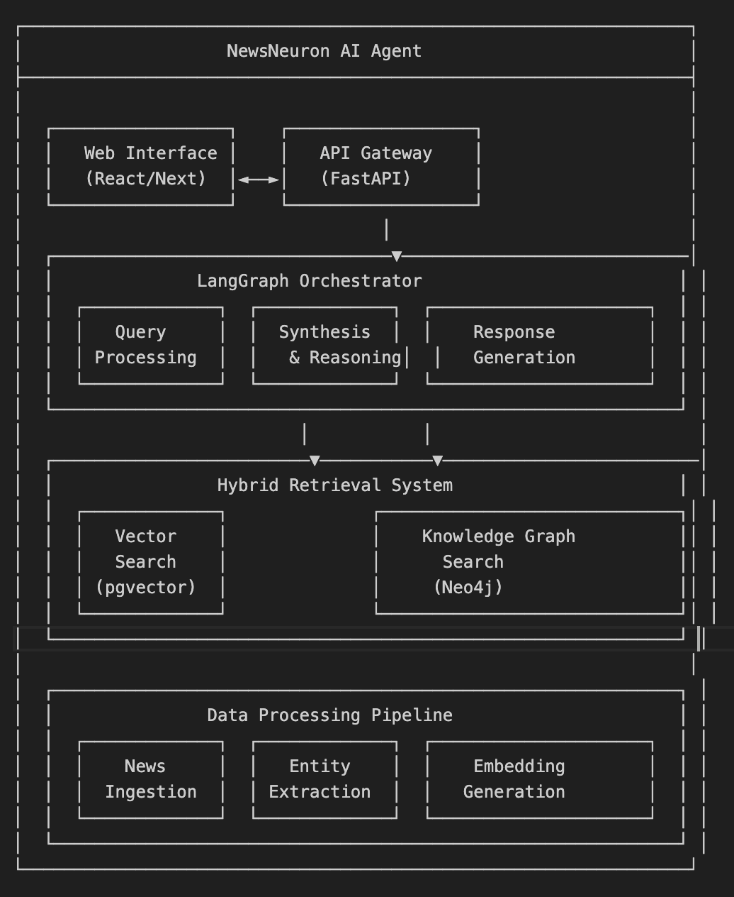

## NewsNeuron
NewsNeuron is an advanced AI agent that redefines news analysis by thinking like a neural network to deliver precise, contextual insights. The system moves beyond standard search by combining the semantic power of Retrieval-Augmented Generation (RAG) with the deep relational understanding of a Knowledge Graph. By integrating vector-based search with relationship-driven graph traversal, NewsNeuron processes information like interconnected neurons, understanding not just the content of the news, but the complex relationships between people, organizations, and events.

#### System Architecture Overview

